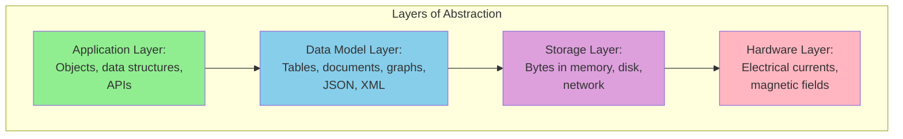
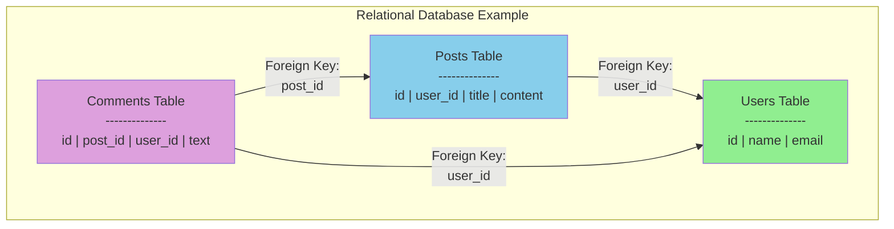
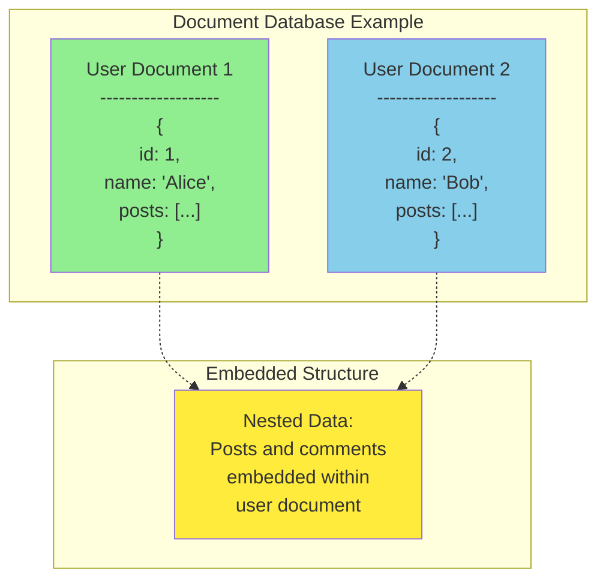
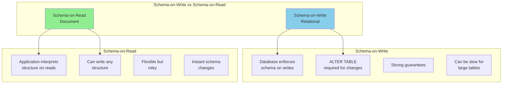
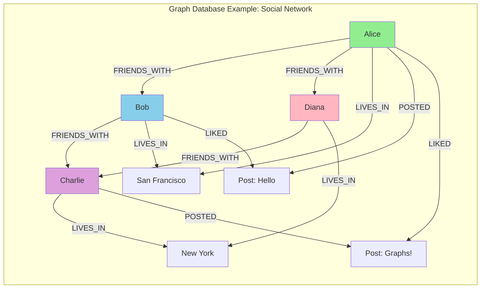

## Introduction

Data models are one of the most important parts of developing software, because they have such a profound effect on how we think about the problem we're solving and how we write the software.



Each layer hides the complexity of the layers below by providing a clean data model. These abstractions allow different groups of people to work together effectively.

This chapter explores the most important data models for data-intensive applications:
- **Relational model** (SQL)
- **Document model** (NoSQL)
- **Graph model**

## 1. Relational model vs document model

### The relational model

Proposed by Edgar Codd in 1970, the relational model organizes data into **relations** (tables), where each relation is a collection of **tuples** (rows).



**Key characteristics**:
- Data organized in tables with fixed schema
- Relationships represented by foreign keys
- Queries use SQL (Structured Query Language)
- ACID transactions for consistency

**Example schema**:
```sql
CREATE TABLE users (
    id SERIAL PRIMARY KEY,
    name VARCHAR(100),
    email VARCHAR(100) UNIQUE,
    created_at TIMESTAMP DEFAULT NOW()
);

CREATE TABLE posts (
    id SERIAL PRIMARY KEY,
    user_id INTEGER REFERENCES users(id),
    title VARCHAR(200),
    content TEXT,
    created_at TIMESTAMP DEFAULT NOW()
);

CREATE TABLE comments (
    id SERIAL PRIMARY KEY,
    post_id INTEGER REFERENCES posts(id),
    user_id INTEGER REFERENCES users(id),
    text TEXT,
    created_at TIMESTAMP DEFAULT NOW()
);
```

### The document model

Document databases (MongoDB, CouchDB) store data as self-contained documents (usually JSON or XML).



**Key characteristics**:
- Data stored as documents (JSON, BSON, XML)
- Schema flexibility (schemaless or schema-on-read)
- Related data often embedded in same document
- Natural fit for hierarchical data

**Example document**:
```json
{
    "_id": "user_1",
    "name": "Alice Johnson",
    "email": "alice@example.com",
    "location": {
        "city": "San Francisco",
        "state": "CA",
        "country": "USA"
    },
    "posts": [
        {
            "id": "post_1",
            "title": "First Post",
            "content": "Hello World!",
            "created_at": "2024-01-15T10:00:00Z",
            "comments": [
                {
                    "user": "Bob",
                    "text": "Great post!",
                    "created_at": "2024-01-15T11:00:00Z"
                }
            ]
        }
    ],
    "created_at": "2024-01-01T00:00:00Z"
}
```

### Comparison: Relational vs document

| Aspect | Relational | Document |
|--------|-----------|----------|
| **Data retrieval** | Multiple queries or joins | Single query |
| **Locality** | Poor (data scattered) | Good (data together) |
| **Duplication** | None (normalized) | Possible if embedded |
| **Schema changes** | ALTER TABLE required | Flexible, gradual migration |

### One-to-many relationships

**Relational approach**: Use foreign keys and joins

```sql
-- Query user with all posts
SELECT users.*, posts.*
FROM users
LEFT JOIN posts ON posts.user_id = users.id
WHERE users.id = 1;
```

**Document approach**: Embed related data

```javascript
// Query user with all posts
db.users.findOne({ _id: "user_1" })
// Returns complete document with embedded posts
```

### Many-to-one and many-to-many relationships

**Problem**: Many entities reference the same data (e.g., many users in same city)

**Relational advantages for many-to-one**:
- **No duplication**: City name stored once
- **Consistency**: Update city name in one place
- **Type safety**: Can enforce valid cities
- **Easy updates**: Rename city affects all users

**Document challenges for many-to-one**:
- Duplication: "San Francisco" stored in many documents
- Inconsistency risk: Some docs might have "SF", others "San Francisco"
- Hard to update: Must update all documents

```python
# Relational: Easy update
db.execute("UPDATE cities SET name = 'San Francisco Bay Area' WHERE id = 5")
# All users automatically see new name

# Document: Hard update
db.users.update_many(
    {"city": "San Francisco"},
    {"$set": {"city": "San Francisco Bay Area"}}
)
# Must find and update all documents
```

<Note>
Many-to-many relationships are even more challenging for documents, often requiring either denormalization with duplication or references (which reduce the benefits of document storage).
</Note>

### Schema flexibility

**Schema-on-write vs schema-on-read**



**Example: Adding a new field**

Relational (schema-on-write):
```sql
-- Must alter table
ALTER TABLE users ADD COLUMN phone VARCHAR(20);

-- For large tables, this can lock the table for hours!
-- All existing rows get NULL for phone
```

Document (schema-on-read):
```javascript
// Just start writing documents with new field
db.users.insertOne({
    name: "Charlie",
    email: "charlie@example.com",
    phone: "555-1234"  // New field, no migration needed!
})

// Application must handle both old and new documents
const user = db.users.findOne({_id: userId})
const phone = user.phone || "Not provided"  // Handle missing field
```

<Tip>
Use schema-on-write when all documents have the same structure and you need strong consistency guarantees. Use schema-on-read when data structure varies or you need rapid iteration with frequent schema changes.
</Tip>

## 2. Query languages

### Declarative vs imperative

**Example: Get all users in California**

Imperative approach (JavaScript):
```javascript
function getUsersInCalifornia(users) {
    const results = []
    for (let i = 0; i < users.length; i++) {
        if (users[i].location.state === 'CA') {
            results.push(users[i])
        }
    }
    return results
}
```

Declarative approach (SQL):
```sql
SELECT * FROM users WHERE state = 'CA';
```

**Why declarative is better**:
- Database can choose optimal execution plan
- Can use indexes automatically
- Can parallelize execution
- More concise and clear
- Less room for bugs

### SQL (Structured Query Language)

SQL is the dominant declarative query language for relational databases.

**Common SQL patterns**:

```sql
-- Basic query
SELECT name, email FROM users WHERE age > 18;

-- Join multiple tables
SELECT users.name, COUNT(posts.id) as post_count
FROM users
LEFT JOIN posts ON posts.user_id = users.id
GROUP BY users.id, users.name
HAVING COUNT(posts.id) > 5;

-- Subquery
SELECT * FROM posts
WHERE user_id IN (
    SELECT id FROM users WHERE location = 'SF'
);

-- Window function
SELECT
    name,
    salary,
    AVG(salary) OVER (PARTITION BY department) as dept_avg
FROM employees;
```

### MapReduce

MapReduce is a programming model for processing large datasets in parallel.

**Example: Count posts per user**

SQL approach:
```sql
SELECT user_id, COUNT(*) as post_count
FROM posts
GROUP BY user_id;
```

MapReduce approach (MongoDB):
```javascript
db.posts.mapReduce(
    // Map function: emit (user_id, 1) for each post
    function() {
        emit(this.user_id, 1);
    },

    // Reduce function: sum all values for each user_id
    function(key, values) {
        return Array.sum(values);
    },

    // Output
    { out: "posts_per_user" }
)
```

### Aggregation pipeline

Modern document databases offer aggregation pipelines as a middle ground.

**Example: Average post length per user**

```javascript
db.posts.aggregate([
    // Stage 1: Calculate length of each post
    {
        $project: {
            user_id: 1,
            length: { $strLenCP: "$content" }
        }
    },

    // Stage 2: Group by user and calculate average
    {
        $group: {
            _id: "$user_id",
            avg_length: { $avg: "$length" },
            post_count: { $sum: 1 }
        }
    },

    // Stage 3: Sort by average length
    {
        $sort: { avg_length: -1 }
    },

    // Stage 4: Limit to top 10
    {
        $limit: 10
    }
])
```

## 3. Graph databases

Some applications have data that's more naturally modeled as a graph: **nodes** (entities) and **edges** (relationships).



### Property graphs

In the **property graph** model:
- Each **node** has:
  - Unique identifier
  - Set of outgoing edges
  - Set of incoming edges
  - Collection of properties (key-value pairs)

- Each **edge** has:
  - Unique identifier
  - Starting node (tail vertex)
  - Ending node (head vertex)
  - Label to describe relationship
  - Collection of properties

**Example in Cypher (Neo4j query language)**:
```cypher
// Create nodes
CREATE (alice:Person {name: 'Alice', age: 30, location: 'SF'})
CREATE (bob:Person {name: 'Bob', age: 28, location: 'SF'})
CREATE (sf:City {name: 'San Francisco', state: 'CA'})

// Create relationships
CREATE (alice)-[:FRIENDS_WITH {since: 2020}]->(bob)
CREATE (alice)-[:LIVES_IN]->(sf)
CREATE (bob)-[:LIVES_IN]->(sf)
```

### Graph queries

Graph databases excel at traversing relationships.

**Example queries**:

```cypher
// 1. Find all friends of Alice
MATCH (alice:Person {name: 'Alice'})-[:FRIENDS_WITH]->(friend)
RETURN friend.name;

// 2. Find friends of friends (excluding direct friends and Alice herself)
MATCH (alice:Person {name: 'Alice'})-[:FRIENDS_WITH]->()-[:FRIENDS_WITH]->(foaf)
WHERE NOT (alice)-[:FRIENDS_WITH]->(foaf) AND foaf <> alice
RETURN DISTINCT foaf.name;

// 3. Find people who live in same city as Alice
MATCH (alice:Person {name: 'Alice'})-[:LIVES_IN]->(city)<-[:LIVES_IN]-(person)
WHERE person <> alice
RETURN person.name, city.name;

// 4. Shortest path between two people
MATCH path = shortestPath(
    (alice:Person {name: 'Alice'})-[:FRIENDS_WITH*]-(diana:Person {name: 'Diana'})
)
RETURN path;
```

### Graph queries in SQL (for comparison)

The same queries in SQL require complex recursive queries:

```sql
-- Find friends of friends (painful in SQL!)
WITH RECURSIVE friends_of_friends AS (
    -- Base case: Direct friends
    SELECT
        friend_id,
        1 as depth
    FROM friendships
    WHERE user_id = (SELECT id FROM users WHERE name = 'Alice')

    UNION

    -- Recursive case: Friends of those friends
    SELECT
        f.friend_id,
        fof.depth + 1
    FROM friendships f
    JOIN friends_of_friends fof ON f.user_id = fof.friend_id
    WHERE fof.depth < 2
)
SELECT DISTINCT u.name
FROM friends_of_friends fof
JOIN users u ON u.id = fof.friend_id
WHERE fof.depth = 2
  AND fof.friend_id NOT IN (
      SELECT friend_id FROM friendships
      WHERE user_id = (SELECT id FROM users WHERE name = 'Alice')
  );
```

<Warning>
Graph databases excel at complex traversal queries, but they may not be the best choice for simple CRUD operations or when you need strong ACID transactions across the entire database.
</Warning>

### When to use graph databases

**Graph DB use cases**:
- Social networks: Friends, followers, connections
- Recommendation engines: Related products
- Fraud detection: Transaction patterns, networks
- Knowledge graphs: Entities and relationships
- Network topology: IT infrastructure, dependencies

**When graphs excel**:
- Many-to-many relationships
- Variable depth traversals
- Relationship properties matter

## 4. Choosing a data model

| Aspect | Relational | Document | Graph |
|--------|-----------|----------|-------|
| **Data structure** | Tables with rows | Documents (JSON/BSON) | Nodes and edges |
| **Schema** | Fixed, schema-on-write | Flexible, schema-on-read | Flexible |
| **Relationships** | Foreign keys, joins | Embedded or references | First-class edges |
| **Query language** | SQL | MongoDB query language, aggregation | Cypher, SPARQL |
| **Best for** | Structured, complex queries | Hierarchical, evolving data | Connected, graph traversal |
| **Strengths** | ACID, mature tooling | Locality, flexibility | Relationships, traversal |
| **Weaknesses** | Schema rigidity | Join limitations | Write scalability |
| **Examples** | PostgreSQL, MySQL | MongoDB, CouchDB | Neo4j, Neptune |

### Real-world examples

**Use relational when:**
```python
# Banking application
# - Strong ACID guarantees needed
# - Complex transactions between accounts
# - Structured financial reports

class BankingApp:
    def transfer_money(self, from_account, to_account, amount):
        with db.transaction():
            # Atomic: Both succeed or both fail
            db.execute(
                "UPDATE accounts SET balance = balance - %s WHERE id = %s",
                [amount, from_account]
            )
            db.execute(
                "UPDATE accounts SET balance = balance + %s WHERE id = %s",
                [amount, to_account]
            )
            db.execute(
                "INSERT INTO transactions (from, to, amount) VALUES (%s, %s, %s)",
                [from_account, to_account, amount]
            )
```

**Use document when:**
```python
# Content management system
# - Articles with varying structure
# - Embedded comments and metadata
# - Rapid iteration on schema

class BlogApp:
    def create_article(self, article_data):
        # Flexible structure, can evolve over time
        db.articles.insert_one({
            "title": article_data["title"],
            "author": article_data["author"],
            "content": article_data["content"],
            "tags": article_data.get("tags", []),
            "metadata": article_data.get("metadata", {}),
            "comments": [],  # Embedded
            "versions": [],  # Keep history
            "created_at": datetime.now()
        })
```

**Use graph when:**
```python
# Social network
# - Complex relationship queries
# - Friend recommendations
# - Influence analysis

class SocialApp:
    def recommend_friends(self, user_id):
        # Find friends of friends with common interests
        query = """
        MATCH (user:Person {id: $user_id})-[:FRIENDS_WITH]->(friend)
              -[:FRIENDS_WITH]->(foaf)
        WHERE NOT (user)-[:FRIENDS_WITH]->(foaf)
          AND foaf <> user
        MATCH (user)-[:INTERESTED_IN]->(interest)<-[:INTERESTED_IN]-(foaf)
        RETURN foaf.name, COUNT(interest) as common_interests
        ORDER BY common_interests DESC
        LIMIT 10
        """
        return graph.execute(query, user_id=user_id)
```

## Summary

Data models are perhaps the most important abstraction in software development.

**Key takeaways**:
- Start with the data model that most naturally fits your data
- Many applications use multiple databases (polyglot persistence)
- The data model shapes how you think about the problem
- Consider access patterns, not just data structure
- Schema flexibility vs. data integrity is a key trade-off

<Accordion title="Quick reference: When to use each model">
**Relational**: Structured data with complex queries and strong consistency requirements

**Document**: Hierarchical or evolving data where related information is accessed together

**Graph**: Highly connected data with complex relationship queries and variable-depth traversals
</Accordion>
