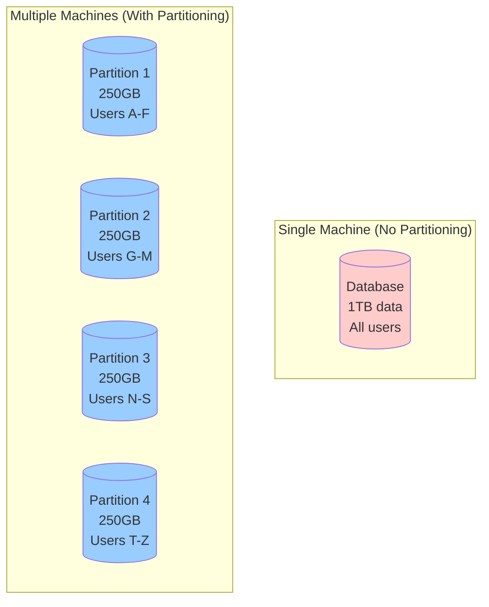
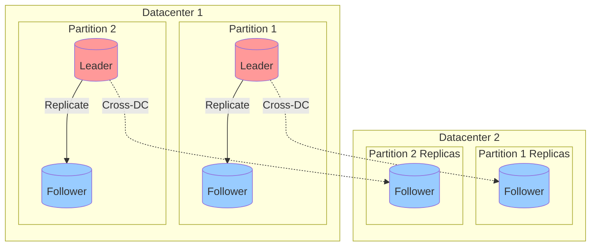
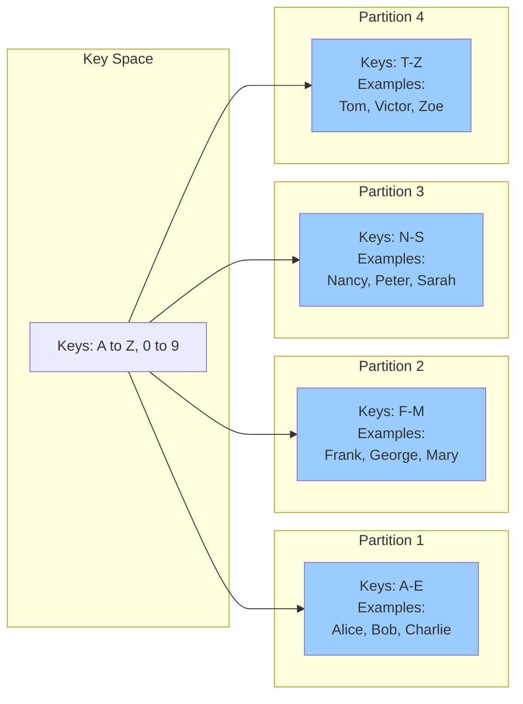

## Introduction

In Chapter 5, we discussed replication - keeping copies of the same data on multiple machines for redundancy and performance. But what if your dataset is so large that it doesn't fit on a single machine? Or what if a single machine cannot handle all the read and write requests?

This is where **partitioning** (also called **sharding**) comes in. Partitioning is the technique of breaking up a large database into smaller pieces, called **partitions**, and distributing them across multiple machines.

### What is partitioning?

**Partitioning** is the process of dividing a dataset into subsets, where each partition is a small database of its own. Although it may access other partitions as needed, each partition can be treated largely independently.



<Info>
**Key terminology**:
- **Partition**: A subset of the data (also called **shard** in MongoDB, **region** in HBase, **vnode** in Cassandra, **vBucket** in Couchbase)
- **Partitioning**: The process of dividing data (also called **sharding**)
- **Partition key**: The value used to determine which partition a piece of data belongs to (also called **shard key**)
</Info>

### Why partition data?

Partitioning is necessary when data grows beyond what a single machine can handle. The main reasons are:

1. **Scalability - Handle more data**
   - Single machine has limited disk capacity (maybe 1-10TB)
   - With partitioning, dataset can grow to petabytes by adding more machines
   - Example: Facebook has petabytes of user data, impossible to store on one machine

2. **Performance - Handle more requests**
   - Single machine has limited CPU and memory
   - Query throughput limited by single machine (e.g., 10,000 queries/second)
   - With partitioning, queries distributed across many machines
   - If you have 10 partitions, theoretically 10x throughput
   - Example: Twitter handles millions of tweets/second by partitioning across thousands of machines

3. **Parallel query processing**
   - Large queries can be parallelized across multiple partitions
   - Each partition processes its subset of data independently
   - Results combined at the end
   - Example: Analytics query "count users by country" - each partition counts its users, results aggregated

<Warning>
**The goal of partitioning**: Spread data and query load evenly across multiple machines. If partitioning is unfair (one partition has more data/queries than others), we call it **skewed**. A partition with disproportionately high load is called a **hot spot**.
</Warning>

### Partitioning vs. replication

Partitioning and replication are often used together:
- **Partitioning**: Divide data into subsets
- **Replication**: Keep multiple copies of each partition for fault tolerance



**Example**: A database with 4 partitions, each replicated 3x (3 replicas per partition) → 12 nodes total.

Each partition has its own leader-follower replication scheme, independent of other partitions.

## Partitioning of key-value data

The fundamental question in partitioning: **How do you decide which records to store on which nodes?**

The goal is to spread data evenly. If partition is unfair, you could end with most data and requests going to one partition (hot spot), making partitioning useless.

Let's explore different partitioning strategies.

### Partitioning by key range

One approach is to assign a continuous range of keys to each partition. Like volumes of an encyclopedia - A-B in volume 1, C-D in volume 2, etc.



**How it works**:
```python
class RangePartitioner:
    def __init__(self, boundaries):
        # boundaries = ['E', 'M', 'S']  means:
        # Partition 1: A-E, Partition 2: F-M, Partition 3: N-S, Partition 4: T-Z
        self.boundaries = sorted(boundaries)

    def get_partition(self, key):
        # Determine which partition a key belongs to
        for i, boundary in enumerate(self.boundaries):
            if key <= boundary:
                return i
        return len(self.boundaries)  # Last partition

# Example usage
partitioner = RangePartitioner(['E', 'M', 'S'])
print(partitioner.get_partition('Alice'))    # 0 (Partition 1: A-E)
print(partitioner.get_partition('Mary'))     # 1 (Partition 2: F-M)
print(partitioner.get_partition('Tom'))      # 3 (Partition 4: T-Z)
```

**Advantages**:

1. **Range queries are efficient**
   - If you want all users from Alice to Charlie, you know they're all in Partition 1
   - No need to query all partitions
   - Example: "Get all temperature readings between timestamp 2024-01-01 and 2024-01-31"

2. **Keys are stored in sorted order within partition**
   - Easier to scan through records in order
   - Good for applications that need sorted data

**Disadvantages**:

<Warning>
1. **Risk of hot spots**
   - If keys are not evenly distributed, some partitions get more data
   - Example: Partition by timestamp - today's data all goes to one partition (very hot!)
</Warning>

**Solution to timestamp hot spot**: Prefix the timestamp with sensor ID or another dimension
```python
# Instead of just timestamp as key
key = timestamp

# Use composite key
key = f"{sensor_id}:{timestamp}"
# Now data distributed across sensors, not just time
```

**Real-world examples**:
- **BigTable/HBase**: Keys stored in sorted order within each partition
- **MongoDB** (before 2.4): Could partition by range (now recommends hash-based)
- **RethinkDB**: Supports range-based sharding

### Partitioning by hash of key

To avoid hot spots and distribute data more evenly, many systems use a hash function to determine the partition.

**How it works**:
```python
class HashPartitioner:
    def __init__(self, num_partitions):
        self.num_partitions = num_partitions

    def get_partition(self, key):
        # Hash the key and mod by number of partitions
        # hash() returns an integer
        return hash(key) % self.num_partitions

# Example usage
partitioner = HashPartitioner(4)
print(partitioner.get_partition('Alice'))    # e.g., 2
print(partitioner.get_partition('Bob'))      # e.g., 0
print(partitioner.get_partition('Charlie'))  # e.g., 3
print(partitioner.get_partition('David'))    # e.g., 1
```

**Hash function properties**:
- A good hash function takes skewed data and makes it uniformly distributed
- Same input always produces same output (deterministic)
- No need for cryptographically strong hash (MD5, SHA-256 overkill)
- Common choices: MurmurHash, CityHash, FNV

<Warning>
**Programming language hash functions warning**:
```python
# Python's built-in hash() is NOT suitable for partitioning!
# It may give different results in different processes

# BAD - Don't use for distributed systems
partition = hash(key) % num_partitions  # ❌

# GOOD - Use consistent hash function
import hashlib
partition = int(hashlib.md5(key.encode()).hexdigest(), 16) % num_partitions  # ✓
```
</Warning>

**Advantages**:

1. **Even distribution of data**
   - Hash function uniformly distributes keys across partitions
   - Reduces risk of hot spots
   - Example: User IDs hashed - users evenly distributed regardless of naming patterns

2. **Automatic load balancing**
   - No manual adjustment of partition boundaries needed
   - Works well even if data access patterns change

**Disadvantages**:

1. **Range queries are inefficient**
   - Adjacent keys in key space end up in different partitions
   - Example: "Get all users from Alice to Charlie" requires querying ALL partitions

2. **Loss of ordering**
   - Hash destroys the natural ordering of keys
   - Can't efficiently iterate through keys in sorted order

**Real-world examples**:
- **Cassandra**: Uses consistent hashing (hash of key determines partition)
- **MongoDB**: Default sharding strategy uses hash of shard key
- **Riak**: Uses consistent hashing
- **DynamoDB**: Hash partitioning

### Consistent hashing

**The problem with simple hash partitioning**: When you add or remove partitions (nodes), most keys need to move to different partitions.

```python
# With 4 partitions
partition = hash(key) % 4  # Key "Alice" → partition 2

# Add 5th partition
partition = hash(key) % 5  # Key "Alice" → partition 4 (moved!)

# Almost all keys move to different partitions!
```

**Consistent hashing** is a technique that minimizes the number of keys that need to be moved when partitions are added or removed.

**How it works**:
1. Hash output space forms a ring (e.g., 0 to 2^32-1, wraps around)
2. Each partition assigned a position on the ring
3. Each key hashed to a position on the ring
4. Key belongs to the next partition clockwise on the ring

**When adding a partition**:
- Only keys between new partition and previous partition need to move
- Other keys stay in same partition

<Tip>
**Advantages**:
- Minimal data movement when adding/removing partitions
- Used by Amazon Dynamo, Cassandra, Riak
</Tip>

<Note>
The term "consistent hashing" is often used loosely. Some databases (like Cassandra) use a variation called "virtual nodes" (vnodes) to improve load distribution.
</Note>

### Skewed workloads and hot spots

Even with hash partitioning, you can still get hot spots in extreme cases.

**Example - Celebrity user problem**:
```python
# Social media platform partitioned by user_id
# User ID: celebrity_123 (millions of followers)

# All writes to celebrity's posts go to one partition!
celebrity_partition = hash('celebrity_123') % num_partitions

# Millions of users reading celebrity's posts
# All reads go to same partition → HOT SPOT! 🔥
```

**Solutions**:

1. **Application-level sharding**:
   ```python
   # Add random suffix to celebrity's posts
   celebrity_id = 'celebrity_123'
   random_suffix = random.randint(0, 99)
   key = f"{celebrity_id}_{random_suffix}"

   # Now celebrity's posts spread across multiple partitions
   # When reading, query all suffixes and merge
   ```

2. **Caching layer**:
   - Put cache (Redis, Memcached) in front of hot partitions
   - Cache absorbs read load
   - Database partition sees less traffic

3. **Read replicas for hot partition**:
   - Create more replicas of the hot partition
   - Distribute reads across replicas

<Note>
**Real-world example**: Twitter's Justin Bieber problem
- When Justin Bieber tweets, millions of followers' timelines need updates
- Twitter had to build special infrastructure to handle celebrity accounts
- Normal partitioning insufficient for such extreme skew
</Note>

## Partitioning and secondary indexes

So far we've discussed partitioning by primary key. But what if you want to query by something other than the primary key?

**Example - Car sales database**:
```sql
-- Primary key: car_id
CREATE TABLE cars (
    car_id INT PRIMARY KEY,
    make VARCHAR(50),
    model VARCHAR(50),
    color VARCHAR(50),
    price DECIMAL
);

-- Easy query (by primary key)
SELECT * FROM cars WHERE car_id = 12345;

-- Hard query (by secondary attribute)
SELECT * FROM cars WHERE color = 'red' AND make = 'Tesla';
```

If partitioned by `car_id`, how do you efficiently find all red Teslas?

This is the problem of **secondary indexes**. Secondary indexes are the bread and butter of relational databases, but they complicate partitioning.

There are two main approaches:

### Document-based partitioning (local indexes)

Each partition maintains its own secondary indexes, covering only the documents in that partition.

**How it works**:
```python
class DocumentPartitionedDB:
    def __init__(self, num_partitions):
        self.partitions = [Partition(i) for i in range(num_partitions)]

    def insert(self, car_id, make, color, price):
        # Partition by primary key
        partition = self.get_partition(car_id)

        # Insert document
        partition.insert(car_id, {'make': make, 'color': color, 'price': price})

        # Update local indexes
        partition.index_color[color].append(car_id)
        partition.index_make[make].append(car_id)

    def query_by_color(self, color):
        # Must query ALL partitions (scatter/gather)
        results = []
        for partition in self.partitions:
            # Each partition searches its local index
            car_ids = partition.index_color.get(color, [])
            results.extend([partition.get(id) for id in car_ids])
        return results
```

**Advantages**:
- **Fast writes**: Only need to update one partition
- **Simple**: Each partition is independent

**Disadvantages**:
- **Slow reads**: Need to query all partitions (scatter/gather)
- Tail latency problem: Read as slow as the slowest partition
- If one partition is slow or unavailable, entire query affected

**Real-world examples**:
- **MongoDB**: Local secondary indexes
- **Elasticsearch**: Each shard has its own indexes
- **Cassandra**: Local secondary indexes (added in version 2.1)
- **Riak**: Search (based on Solr) uses local indexes

### Term-based partitioning (global indexes)

Instead of each partition having its own local index, we construct a **global index** that covers all partitions. The global index itself is partitioned, but differently from the primary key.

**How it works**:
- Global index partitioned by the indexed field (e.g., color)
- color: a-m → Index Partition 0
- color: n-z → Index Partition 1
- All red cars (regardless of car_id) → same index partition

**Advantages**:
- **Fast reads**: Only need to query one index partition
- More efficient for read-heavy workloads
- Better performance for queries on secondary attributes

**Disadvantages**:
- **Slow writes**: Must update multiple partitions (data + indexes)
- Complex distributed transactions needed
- Often updated asynchronously (eventual consistency)

**Real-world examples**:
- **DynamoDB**: Global Secondary Indexes (GSIs)
- **Riak Search**: Can use global indexes
- **Oracle**: Global indexes in partitioned tables

**Synchronous vs. Asynchronous updates**:

Most implementations update global indexes **asynchronously**:

With asynchronous updates:
- Writes faster (don't wait for index updates)
- But: Reads may not immediately see new data
- Eventually consistent (index catches up)

### Comparison: local vs. global indexes

| Aspect | Document-Based (Local) | Term-Based (Global) |
|--------|----------------------|-------------------|
| Write speed | Fast (single partition) | Slow (multiple partitions) |
| Read speed | Slow (query all partitions) | Fast (query specific partition) |
| Consistency | Immediate | Often eventual |
| Complexity | Simple | Complex |
| Best for | Write-heavy workloads | Read-heavy workloads |
| Examples | MongoDB, Elasticsearch | DynamoDB GSI |

## Rebalancing partitions

Over time, things change in a database cluster:
- **Data size increases**: More data doesn't fit in existing partitions
- **Query load increases**: Need more machines to handle traffic
- **Machines fail**: Need to redistribute load to surviving machines
- **New machines added**: Want to take advantage of additional resources

All of these changes require moving data from one partition to another. This process is called **rebalancing**.

### Requirements for rebalancing

No matter which strategy we use, rebalancing should meet these requirements:

1. **After rebalancing, load should be shared fairly** between nodes
   - Data and query load distributed evenly
   - No hot spots created

2. **Database should continue accepting reads and writes** during rebalancing
   - No downtime
   - Minimal performance impact

3. **No more data than necessary should be moved** between nodes
   - Moving data is expensive (network bandwidth, disk I/O)
   - Minimize disruption

### Strategies for rebalancing

#### Don't hash mod N (bad approach)

A naive approach is to use `hash(key) % N` where N is number of nodes. **This is terrible for rebalancing!**

```python
# Initial: 3 nodes
partition = hash(key) % 3

# Add 4th node
partition = hash(key) % 4

# Almost EVERY key moves to different partition!
```

<Warning>
**Problem**: When N changes, almost all keys need to move. This is expensive and causes massive data transfer.
</Warning>

#### Fixed number of partitions

Create many more partitions than nodes, then assign multiple partitions to each node.

**How it works**:
- Create fixed number of partitions (e.g., 1000 partitions)
- Each node owns several partitions
- When new node added: Steal a few partitions from existing nodes
- Partitions themselves don't change, just reassigned to different nodes

**Advantages**:
- Only entire partitions moved (clear boundaries)
- Can move partition while continuing to serve reads/writes (replica takes over)
- Number of partitions doesn't change

**Real-world examples**:
- **Riak**: 64 partitions per node (if cluster has 10 nodes → 640 partitions)
- **Elasticsearch**: Shards created upfront, can't change without reindexing
- **Couchbase**: 1024 vBuckets per bucket

**Limitation**: Number of partitions fixed upfront. If dataset grows beyond initial estimate, partitions become too large.

#### Dynamic partitioning

Create partitions dynamically based on data size. When partition grows too large, split it. When partition shrinks too small, merge it.

**Advantages**:
- Number of partitions adapts to data volume
- Works well with both key-range and hash partitioning
- Empty database starts with small number of partitions, grows organically

**Disadvantages**:
- Empty database starts with single partition → all writes to one node (hot spot)
- **Pre-splitting**: Some databases allow configuring initial set of partitions

**Real-world examples**:
- **HBase**: Automatic partition splitting
- **MongoDB**: Automatic chunk splitting (64MB chunks)
- **RethinkDB**: Dynamic sharding

#### Partitioning proportionally to nodes

Make the number of partitions proportional to the number of nodes - fixed number of partitions per node.

```python
# Each node gets fixed number of partitions (e.g., 128)
num_partitions = num_nodes * 128

# Add node: Number of partitions increases
# Remove node: Number of partitions decreases
```

**Advantages**:
- Automatically adapts to cluster size
- Each new node takes fair share of load

**Real-world examples**:
- **Cassandra**: Uses vnodes (virtual nodes), default 256 per physical node
- **Riak**: Also uses vnodes

### Comparison of rebalancing strategies

| Strategy | Partition Count | When to Split | Best For | Examples |
|----------|----------------|---------------|----------|----------|
| Fixed partitions | Fixed upfront | Never | Known dataset size | Riak, Elasticsearch |
| Dynamic partitions | Changes with data size | Partition too large/small | Unknown growth | HBase, MongoDB |
| Proportional to nodes | Changes with cluster size | Add/remove node | Variable cluster size | Cassandra, Riak vnodes |

### Automatic vs. manual rebalancing

**Automatic rebalancing**:
- System automatically decides when and how to move partitions
- Convenient, less operational burden
- Risk: Can go wrong (move too much data, overwhelm network, cause cascading failures)

**Manual rebalancing**:
- Human administrator decides partition assignment
- System executes the move
- More control, prevents surprises
- Requires more operational effort

<Tip>
**Best practice**: Automatic generation of rebalancing plan, but human approval before execution
</Tip>

## Request routing

We've discussed how data is partitioned across nodes. Now: **How does a client know which node to connect to?** When a client wants to make a request, which node should it connect to?

This is an instance of a more general problem called **service discovery**.

### Approaches to request routing

There are three main approaches:

#### Approach 1: Client contacts any node

Client sends request to any node (via load balancer). If that node owns the partition, it handles the request. Otherwise, it forwards to the correct node.

**Advantages**:
- Client doesn't need to know cluster topology
- Simple client logic
- Any node can handle any request (after forwarding)

**Disadvantages**:
- Extra network hop if first node doesn't have data
- All nodes need routing table

**Real-world examples**:
- **Cassandra**: Uses this approach (gossip protocol shares routing info)
- **Riak**: Similar approach

#### Approach 2: Routing tier

Client contacts a routing tier (partition-aware load balancer), which determines the correct node and forwards the request.

**Advantages**:
- Client completely unaware of partitioning
- Routing logic centralized (easier to update)
- Nodes don't need to forward requests

**Disadvantages**:
- Routing tier is additional component (single point of failure unless replicated)
- Extra network hop

**Real-world examples**:
- **MongoDB**: Uses mongos routers (routing tier)

#### Approach 3: Client-side routing

Client is aware of partitioning scheme and directly contacts the correct node.

**Advantages**:
- Most efficient (no extra hops)
- No additional routing infrastructure needed

**Disadvantages**:
- Client needs to be partition-aware
- Client needs to track cluster changes
- More complex client logic

### How does routing learn about partition changes?

When partitions are rebalanced, routing decisions need to change. How do components learn about these changes?

#### Approach: Coordination service (e.g., ZooKeeper)

Many distributed systems use a separate coordination service like ZooKeeper to track cluster metadata.

**How it works**:
1. Each node registers itself in ZooKeeper with partition assignments
2. Routing tier (or client) subscribes to ZooKeeper for updates
3. When partitions reassigned, ZooKeeper notifies subscribers
4. Routing tier updates its routing table

**Real-world examples**:
- **HBase**: Uses ZooKeeper for metadata
- **Kafka**: Uses ZooKeeper (moving away from it in newer versions)
- **SolrCloud**: Uses ZooKeeper

#### Approach: Gossip protocol

Nodes communicate directly with each other to share cluster state (no external coordination service).

**How gossip works**:
1. Every node periodically picks random node to share state with
2. Information spreads through cluster exponentially fast
3. Eventually all nodes have consistent view of cluster

**Real-world examples**:
- **Cassandra**: Uses gossip protocol
- **Riak**: Also uses gossip

## Summary

Partitioning is essential for scaling beyond what a single machine can handle. Key takeaways:

**Partitioning strategies**:
- **Key range**: Efficient range queries, but risk of hot spots
- **Hash**: Even distribution, but inefficient range queries
- **Consistent hashing**: Minimal rebalancing when nodes added/removed

**Secondary indexes**:
- **Local (document-based)**: Fast writes, slow reads (scatter/gather)
- **Global (term-based)**: Fast reads, slow writes (distributed updates)

**Rebalancing**:
- **Fixed partitions**: Simple, but need to choose number upfront
- **Dynamic partitions**: Adapts to data size, but complex
- **Proportional to nodes**: Adapts to cluster size

**Request routing**:
- Client to any node (with forwarding)
- Routing tier (partition-aware load balancer)
- Client-side routing (partition-aware client)
- Use ZooKeeper or gossip for coordination

<Warning>
The main challenge with partitioning is avoiding **hot spots** - ensuring data and query load is distributed evenly across all partitions. This requires careful choice of partition key and strategy.
</Warning>
