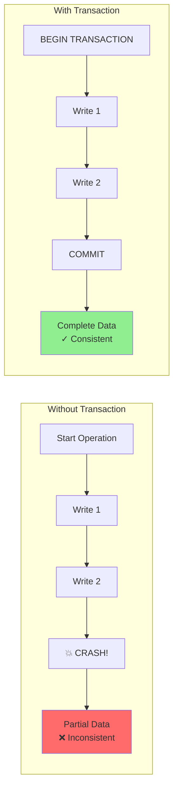
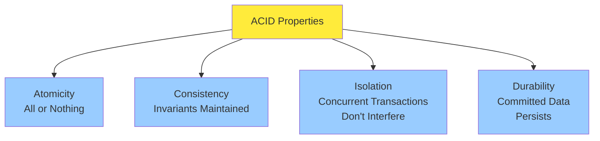
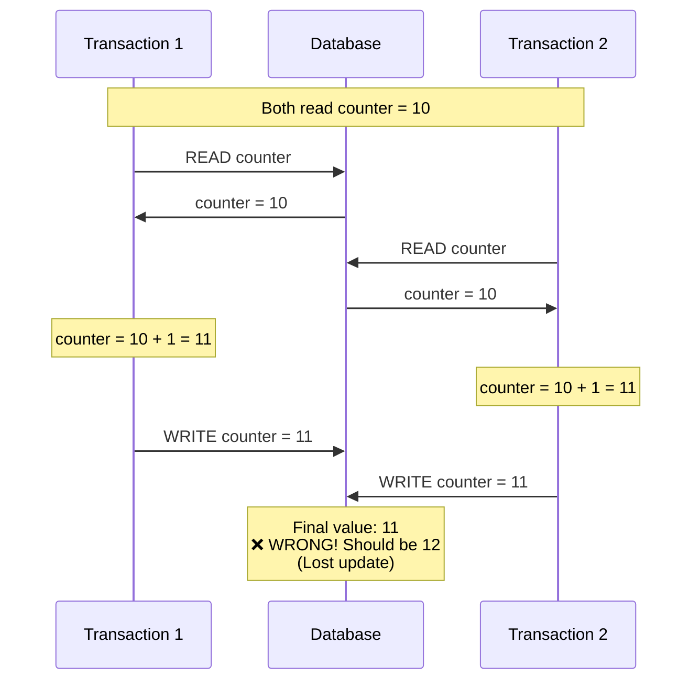
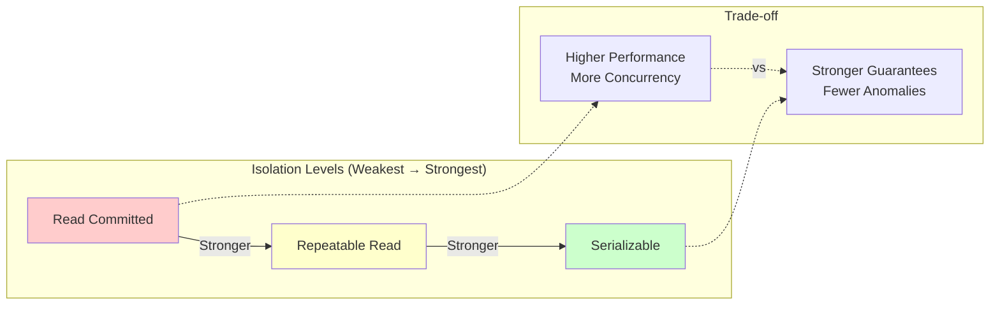
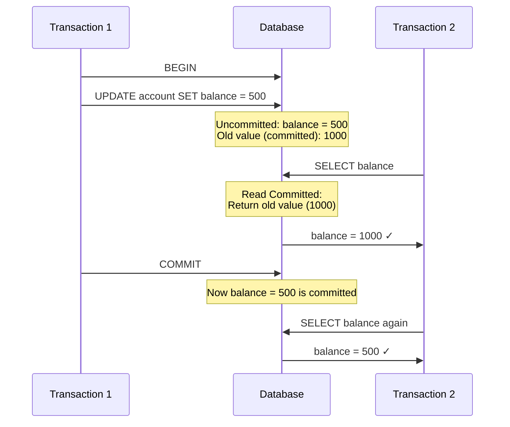
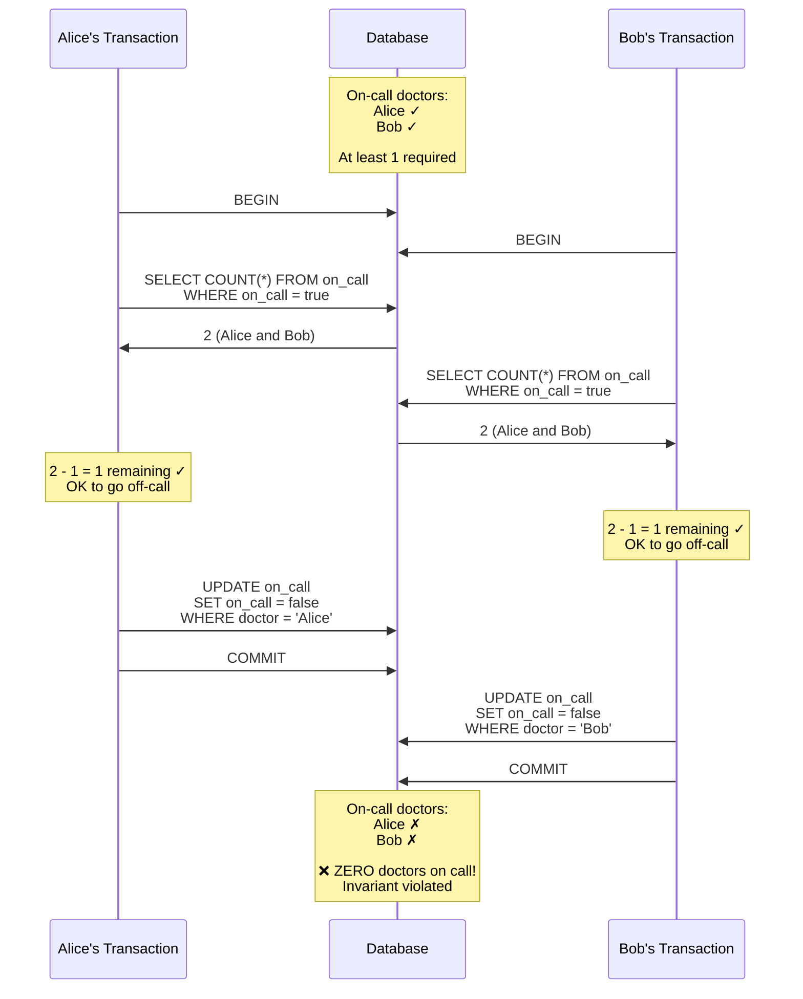

## Introduction

In the real world, many things can go wrong when working with data:
- The database software or hardware may fail at any time (including in the middle of a write operation)
- The application may crash at any time (including in the middle of a series of operations)
- Network interruptions can unexpectedly cut off the application from the database, or one database node from another
- Several clients may write to the database at the same time, overwriting each other's changes
- A client may read data that doesn't make sense because it has only partially been updated
- Race conditions between clients can cause surprising bugs

For decades, **transactions** have been the mechanism of choice for simplifying these issues. A transaction is a way for an application to group several reads and writes together into a logical unit. Conceptually, all the reads and writes in a transaction are executed as one operation: either the entire transaction succeeds (commit) or it fails (abort, rollback). If it fails, the application can safely retry.



### Why transactions?

Transactions simplify the programming model for applications accessing a database. By using transactions, the application can pretend that certain concurrency problems and certain kinds of hardware and software faults don't exist. A large class of errors is reduced to a simple transaction abort, and the application just needs to retry.

**Without transactions**, you need to worry about:
- What happens if the database crashes while writing multiple records?
- What happens if two clients try to update the same data at the same time?
- How to handle partial failures in complex operations?

**With transactions**, the database takes care of these problems.

### The ACID properties

The safety guarantees provided by transactions are often described by the acronym **ACID**: **Atomicity**, **Consistency**, **Isolation**, and **Durability**.



However, in practice, these terms are somewhat ambiguous and implementations vary. Let's examine each property in detail.

## Atomicity

**Atomicity** means that a transaction is treated as a single, indivisible unit of work. Either all of its operations succeed (and the transaction commits), or none of them do (the transaction aborts and all changes are rolled back).

### Example: bank transfer

The classic example is transferring money between bank accounts:

```python
# Without atomicity - DANGEROUS!
def transfer_money_unsafe(from_account, to_account, amount):
    # Step 1: Deduct from source account
    from_balance = db.get_balance(from_account)
    db.set_balance(from_account, from_balance - amount)

    # 💥 CRASH HERE = Money disappears!

    # Step 2: Add to destination account
    to_balance = db.get_balance(to_account)
    db.set_balance(to_account, to_balance + amount)

# With atomicity - SAFE!
def transfer_money_safe(from_account, to_account, amount):
    db.begin_transaction()
    try:
        # Step 1: Deduct from source account
        from_balance = db.get_balance(from_account)
        db.set_balance(from_account, from_balance - amount)

        # Step 2: Add to destination account
        to_balance = db.get_balance(to_account)
        db.set_balance(to_account, to_balance + amount)

        # Both operations succeed
        db.commit()
    except Exception as e:
        # If anything goes wrong, undo all changes
        db.rollback()
        raise e
```

<Info>
**Key points**:
- If any operation in the transaction fails, **all previous operations are undone**
- The database guarantees that you never end up in a state where money was deducted but not added
- This is sometimes called **all-or-nothing** guarantee
</Info>

### Abort and retry

If a transaction aborts, the application can safely retry it. However, retry logic isn't perfect:

<Warning>
**Problems with retry**:
1. **Network failures**: Transaction might have succeeded, but network error prevented acknowledgment. Retrying could duplicate the transaction!
2. **Overload**: If transaction failed due to system overload, retrying immediately makes it worse
3. **Permanent errors**: Some errors aren't transient (constraint violations). Retrying won't help
4. **Side effects**: If transaction has side effects outside the database (sending email), retrying causes duplicates
</Warning>

## Consistency

**Consistency** in ACID is actually a property of the application, not the database. The database provides mechanisms (constraints, triggers), but the application is responsible for defining what "consistency" means.

<Info>
**Key points**:
- The "C" in ACID is somewhat misnamed - it's really about application correctness
- Atomicity, Isolation, and Durability are properties of the database
- Consistency is a property of the application
- The application relies on the database's atomicity and isolation to achieve consistency
</Info>

## Isolation

**Isolation** means that concurrently executing transactions are isolated from each other. Each transaction can pretend that it's the only transaction running on the entire database.

### The problem: concurrent transactions

Without isolation, concurrent transactions can interfere with each other in confusing ways:



This is called a **lost update** - one transaction's write overwrites another's, as if it never happened.

### Isolation levels

In practice, full isolation is expensive (requires serialization, which hurts performance). Most databases offer several **isolation levels**, trading off consistency guarantees for performance.



We'll explore each isolation level in detail in the following sections.

## Durability

**Durability** is the promise that once a transaction has committed successfully, any data it has written will not be forgotten, even if there's a hardware fault or the database crashes.

### How durability works

**Single-node database**:
```python
class DurableDatabase:
    def commit_transaction(self, transaction):
        # 1. Write all changes to write-ahead log (WAL)
        wal_records = transaction.get_changes()
        self.write_ahead_log.append(wal_records)

        # 2. Force write to disk (fsync)
        # This is the expensive part - waiting for disk
        self.write_ahead_log.fsync()

        # 3. Only now acknowledge to client
        # Data is durable even if we crash after this point
        return "COMMIT SUCCESS"

    def recover_after_crash(self):
        # Replay write-ahead log
        for record in self.write_ahead_log.read_all():
            self.apply_change(record)

        # Database state restored!
```

**Replicated database**:
- Write data to multiple nodes
- Only acknowledge commit after data written to multiple nodes
- If one node fails, data survives on other nodes

### Durability limitations

<Warning>
**Perfect durability is impossible**:
- If all replicas (and backups) are destroyed simultaneously, data is lost
- Correlated failures: datacenter power outage, natural disaster
- Storage media can become corrupted
</Warning>

**Trade-offs**:
```python
# Strong durability (slow)
def commit_with_sync():
    wal.append(changes)
    wal.fsync()  # Wait for disk write ~10ms
    return "COMMIT"

# Weak durability (fast)
def commit_without_sync():
    wal.append(changes)
    # Don't wait for fsync - OS will flush eventually
    return "COMMIT"  # Returns immediately

# Risk: If crash before OS flushes, data lost
# Benefit: Much faster (microseconds instead of milliseconds)
```

## Isolation levels and concurrency problems

Now let's dive deep into isolation - the most complex of the ACID properties. We'll explore the problems that can occur when transactions run concurrently, and the isolation levels that prevent them.

### Read committed

**Read Committed** is the most basic level of transaction isolation. It makes two guarantees:

1. **No dirty reads**: Only read data that has been committed
2. **No dirty writes**: Only overwrite data that has been committed

#### No dirty reads

**Dirty read**: Reading uncommitted data written by another transaction.

**Prevention with Read Committed**:


#### No dirty writes

**Dirty write**: Overwriting uncommitted data written by another transaction.

<Note>
**Most databases** use Read Committed as the default isolation level (PostgreSQL, Oracle, SQL Server).
</Note>

### Snapshot isolation (repeatable read)

Read Committed prevents dirty reads, but still allows **non-repeatable reads**:

**Non-repeatable read**: Same query returns different results within a transaction.

**Solution: Snapshot Isolation** (also called **Repeatable Read**):

Each transaction reads from a **consistent snapshot** of the database - the transaction sees all data that was committed at the start of the transaction, plus its own uncommitted writes.

#### Why snapshot isolation is important

Snapshot Isolation solves critical real-world problems that Read Committed cannot handle:

**Real-world scenario 1: Database Backup**

Without snapshot isolation, backups are unreliable:

```python
# Backup process without snapshot isolation
def backup_database_bad():
    """
    This can produce an inconsistent backup!
    """
    backup = {}

    # Start backup at 10:00 AM
    backup['users'] = db.query("SELECT * FROM users")  # Takes 5 minutes

    # Meanwhile at 10:03 AM, a user transfers money:
    # - Deduct from account A
    # - Add to account B

    # Backup continues at 10:05 AM
    backup['accounts'] = db.query("SELECT * FROM accounts")  # Takes 5 minutes

    # Result: Backup shows user before transfer, but accounts after transfer
    # The money appears twice or disappears entirely!
    return backup

# With snapshot isolation
def backup_database_good():
    """
    Snapshot isolation guarantees consistent backup
    """
    with db.transaction(isolation='snapshot'):  # PostgreSQL: REPEATABLE READ
        # All reads see database state at 10:00 AM
        backup['users'] = db.query("SELECT * FROM users")
        # Even though this runs at 10:05 AM, it still sees 10:00 AM state
        backup['accounts'] = db.query("SELECT * FROM accounts")

    # Result: Backup is a consistent snapshot from a single point in time
    return backup
```

<Accordion title="When Snapshot Isolation is Critical">
**Use Cases Requiring Snapshot Isolation**:

1. **Long-running analytics queries**: Need consistent view even when transaction runs for minutes or hours
2. **Database backups**: Must capture consistent state across all tables
3. **Data integrity checks**: Validation must see stable data
4. **Report generation**: Numbers must add up consistently
5. **ETL processes**: Extract data in consistent state
6. **Batch processing**: Process consistent dataset

**When Snapshot Isolation May NOT Be Needed**:

1. **Short transactions**: If your transaction only does a single read or write, Read Committed is sufficient
2. **No multi-step reads**: If you don't read the same data twice in a transaction
3. **When you need to see latest data**: Snapshot isolation shows data at start of transaction, not latest
</Accordion>

#### Multi-version concurrency control (MVCC)

**Implementation**: Keep multiple versions of each object, tagged with transaction ID that created it.

**Benefits**:
- Long-running read transactions don't block writes
- Writes don't block reads
- Better performance for read-heavy workloads

**Used by**: PostgreSQL, MySQL (InnoDB), Oracle, SQL Server

### Lost updates

Even with snapshot isolation, some problems remain. One important one is **lost updates**.

**Lost update**: Two transactions read a value, modify it, and write it back, with one modification getting lost.

#### Solutions to lost updates

**Solution 1: Atomic Write Operations**

```sql
-- Bad: Read-modify-write (subject to lost updates)
counter = SELECT value FROM counters WHERE id = 1;
counter = counter + 1;
UPDATE counters SET value = counter WHERE id = 1;

-- Good: Atomic increment
UPDATE counters SET value = value + 1 WHERE id = 1;
```

**Solution 2: Explicit Locking**

```sql
BEGIN TRANSACTION;

-- Lock the row for update
SELECT * FROM products WHERE id = 123 FOR UPDATE;

-- Now modify it (no one else can modify until we commit)
UPDATE products SET quantity = quantity - 1 WHERE id = 123;

COMMIT;
```

**Solution 3: Compare-and-Set (CAS)**

```sql
-- Only update if value hasn't changed since you last read
UPDATE products
SET quantity = 5  -- New value
WHERE id = 123
  AND quantity = 6;  -- Expected old value

-- If 0 rows updated, value changed -> retry
```

### Write skew and phantoms

**Write skew** is a generalization of lost updates. It happens when two transactions read the same objects, then update some of those objects (different ones). Because they update different objects, neither transaction sees a conflict, yet an invariant is violated.

#### Example: on-call doctor scheduling

**Business rule**: At least one doctor must be on call at all times.



<Warning>
**Why snapshot isolation doesn't prevent this**:
- Both transactions read different snapshots showing 2 doctors on call
- Each transaction updates a different row (no write conflict detected)
- Both commit successfully
- Invariant violated: 0 doctors on call
</Warning>

#### Solutions to write skew

**Solution 1: Serializable Isolation**

Use the strongest isolation level (covered next section).

**Solution 2: Explicit Locks**

```sql
BEGIN TRANSACTION;

-- Lock all on-call doctors
SELECT * FROM doctors
WHERE on_call = true
FOR UPDATE;

-- Check constraint
IF (SELECT COUNT(*) FROM doctors WHERE on_call = true) > 1 THEN
    -- Safe to go off-call
    UPDATE doctors SET on_call = false WHERE name = 'Alice';
END IF;

COMMIT;
```

### Serializable isolation

**Serializable** isolation is the strongest isolation level. It guarantees that even though transactions may execute in parallel, the end result is the same as if they executed one at a time, in **some** serial order.

Three main techniques for implementing serializability:

#### Actual serial execution

The simplest way to avoid concurrency problems: don't allow concurrency! Execute one transaction at a time, in serial order.

**This seems crazy** (throwing away concurrency), but it's viable if:
1. Transactions are very fast (no slow I/O)
2. Dataset fits in memory (no disk seeks)
3. Single-threaded CPU can handle the throughput

**Real-world example**: Redis, VoltDB, Datomic

**Limitations**:
- Throughput limited to single CPU core
- Can't do slow I/O (network requests, disk seeks)
- Multi-partition transactions expensive (coordination needed)

#### Two-phase locking (2PL)

For decades, the standard way to implement serializability. Stronger than locks we've seen before.

**Rules**:
1. If transaction wants to **read** an object, must acquire **shared lock**
   - Multiple transactions can hold shared lock simultaneously
2. If transaction wants to **write** an object, must acquire **exclusive lock**
   - No other locks (shared or exclusive) can be held simultaneously
3. If transaction holds a lock, it holds it until transaction commits or aborts (**two-phase**: acquire locks, then release all at end)

**Performance problems**:
- **Poor concurrency**: Readers and writers block each other
- **Deadlocks**: Two transactions waiting for each other's locks

**Used by**: MySQL (InnoDB), SQL Server, DB2

#### Serializable snapshot isolation (SSI)

A newer algorithm that provides serializable isolation with better performance than 2PL.

**Key idea**: Use snapshot isolation, but detect when isolation has been violated and abort transactions.

**How it works**:
1. Transactions execute using snapshot isolation (MVCC)
2. Database tracks **reads and writes** to detect conflicts
3. When a potential conflict detected, abort one transaction

**Used by**: PostgreSQL (since 9.1), FoundationDB

## Summary

Transactions are fundamental to reliable database systems. Key takeaways:

**ACID Properties**:
- **Atomicity**: All or nothing - transaction either completes fully or not at all
- **Consistency**: Application-defined invariants maintained
- **Isolation**: Concurrent transactions don't interfere with each other
- **Durability**: Committed data persists even after crashes

**Isolation Levels**:

| Level | Prevents Dirty Reads | Prevents Lost Updates | Prevents Write Skew | Performance |
|-------|---------------------|---------------------|-------------------|-------------|
| Read Committed | ✓ | ❌ | ❌ | High |
| Snapshot Isolation | ✓ | Sometimes | ❌ | Medium |
| Serializable | ✓ | ✓ | ✓ | Low |

**When to Use What**:
- **Read Committed**: Default for most applications, good balance
- **Snapshot Isolation**: Long-running analytics, backups, reports
- **Serializable**: Critical operations requiring strongest guarantees

<Tip>
**Practical advice**: Start with Read Committed. Use Snapshot Isolation for long-running read operations. Only use Serializable when absolutely necessary, as it has significant performance costs.
</Tip>
