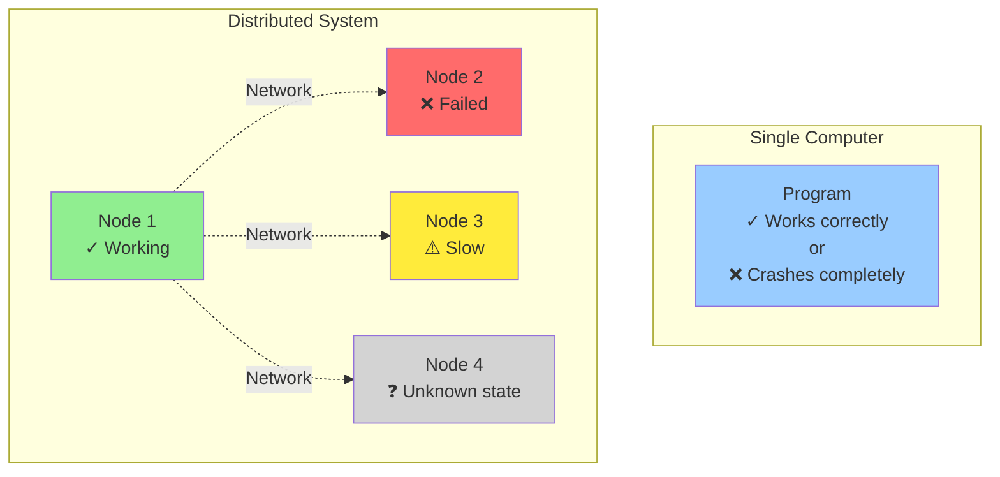
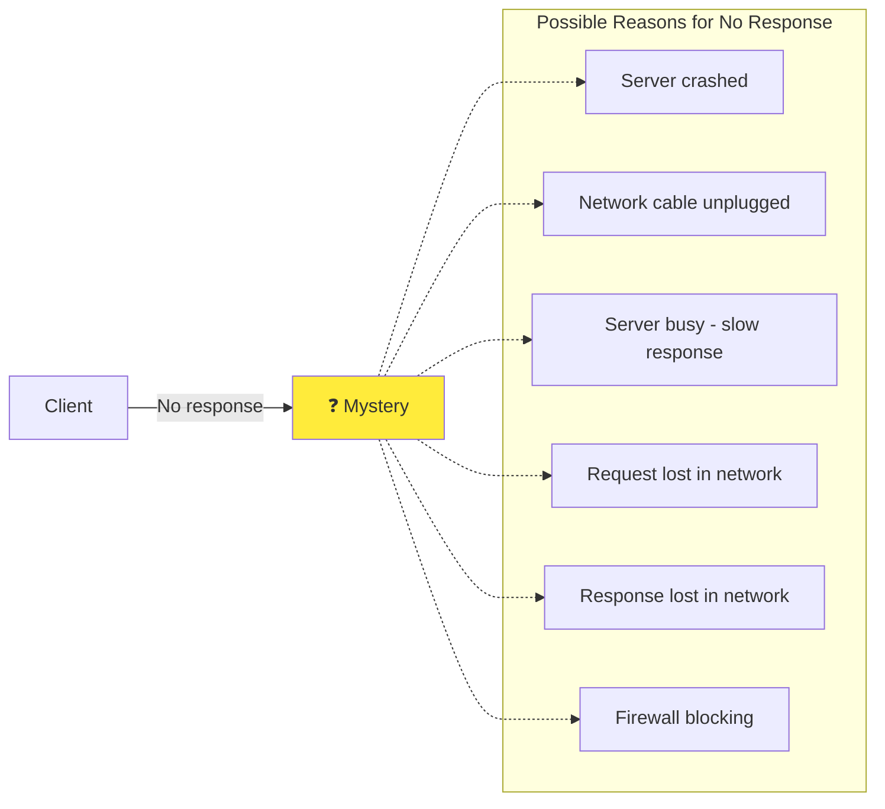
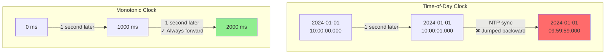
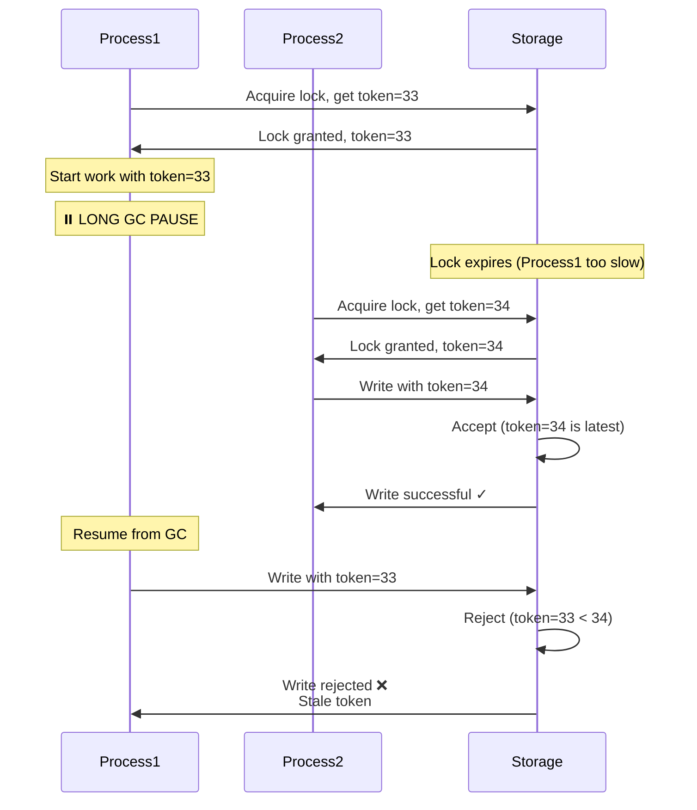

## Introduction

In previous chapters, we've discussed replication (Chapter 5), partitioning (Chapter 6), and transactions (Chapter 7). These techniques help build reliable systems from unreliable components. However, we've glossed over many problems that occur in distributed systems.

Working with distributed systems is fundamentally different from writing software on a single computer. A program on a single computer either works or it doesn't - there's usually no middle ground. But in a distributed system, **partial failures** are the norm.



This chapter explores the harsh realities of distributed systems - all the things that can go wrong, and what we can (and cannot) do about them.

### Why build distributed systems?

Despite the complexity, we build distributed systems because:

1. **Scalability**: Single machine has limited resources
2. **Fault tolerance**: Hardware failures are inevitable
3. **Low latency**: Serve users from geographically distributed locations
4. **Availability**: Keep system running even when parts fail

<Warning>
**The challenge**: These benefits come at the cost of complexity. We must deal with:
- Unreliable networks
- Unreliable clocks
- Partial failures
- Process pauses
- Non-determinism
</Warning>

## Faults and partial failures

### Single computer vs. distributed system

**Single computer** (idealistic model):
- Either works correctly, or doesn't work at all
- When hardware fault occurs, system usually crashes completely
- Software bugs are deterministic (same input → same output)

**Distributed system** (realistic model):
- Some parts work, some parts fail
- Network may lose, delay, or duplicate messages
- Different nodes may see events in different orders
- Nondeterministic behavior

### Partial failures are nondeterministic

In distributed systems, you cannot easily distinguish between:
- Node crashed
- Network connection broken
- Node slow (still processing)
- Request lost in network
- Response lost in network



## Unreliable networks

Most distributed systems use **asynchronous networks** (like the internet). In an asynchronous network, there are no guarantees about:
- When a message will arrive (if at all)
- How long it will take
- Whether the recipient is alive

### Network faults in practice

Network problems are more common than you might think:

**Example incidents**:
1. **Shark bites undersea cables** (really happened!)
2. **Network switches fail or misconfigured**
3. **Data center network partitions** (split into two groups that can't communicate)
4. **Network congestion** (packets delayed or dropped)
5. **Entire data center connectivity lost** (power failure, backhoe cuts fiber)

```python
# Handling network timeouts
class RobustNetworkClient:
    def __init__(self, max_retries=3, timeout=5):
        self.max_retries = max_retries
        self.timeout = timeout

    def send_with_retry(self, request):
        for attempt in range(self.max_retries):
            try:
                response = self.send_request(request, timeout=self.timeout)
                return response
            except Timeout:
                if attempt < self.max_retries - 1:
                    # Exponential backoff
                    wait_time = 2 ** attempt
                    time.sleep(wait_time)
                    continue
                else:
                    raise NetworkError("Failed after {} retries".format(self.max_retries))
```

### Detecting faults

How can you tell if a remote node is down?

**Most common approach**: Timeouts

```python
# Timeout-based failure detection
import time

class FailureDetector:
    def __init__(self, timeout=10):
        self.timeout = timeout
        self.last_heartbeat = {}

    def record_heartbeat(self, node_id):
        self.last_heartbeat[node_id] = time.time()

    def is_alive(self, node_id):
        if node_id not in self.last_heartbeat:
            return False

        elapsed = time.time() - self.last_heartbeat[node_id]
        return elapsed < self.timeout

    def get_dead_nodes(self):
        current_time = time.time()
        dead_nodes = []

        for node_id, last_time in self.last_heartbeat.items():
            if current_time - last_time > self.timeout:
                dead_nodes.append(node_id)

        return dead_nodes
```

<Warning>
**Problems with timeouts**:
- Too short: False positives (declare node dead when just slow)
- Too long: Takes longer to detect real failures
- Variable network latency makes it hard to choose good timeout
</Warning>

### Timeouts and unbounded delays

In an **asynchronous network**, there's no upper bound on how long a message can take.

**Why packets get delayed**:
- Application queue waiting to send
- OS network queue
- Network switch queue
- Recipient's OS queue
- Recipient application queue/busy
- TCP congestion control
- Network congestion

<Info>
**Most latency comes from queuing**, not the physical network.
</Info>

### Network congestion and queueing

**TCP congestion control**: Sender adjusts rate based on packet loss

**Switch queues**: When network congested, switches queue packets

```python
# Simplified switch queue simulation
class NetworkSwitch:
    def __init__(self, queue_size=100):
        self.queue = []
        self.queue_size = queue_size

    def receive_packet(self, packet):
        if len(self.queue) < self.queue_size:
            self.queue.append(packet)
            return True
        else:
            # Queue full - drop packet!
            return False

    def forward_packets(self):
        # Forward packets at link speed
        if self.queue:
            packet = self.queue.pop(0)
            return packet
        return None
```

## Unreliable clocks

Distributed systems need to measure time for:
- Request timeouts
- Performance metrics
- Ordering events
- Expiring cached data

But in a distributed system, **time is tricky**.

### Types of clocks

**Time-of-day clocks** (wall-clock time):
- Returns current date and time
- Usually synchronized with NTP (Network Time Protocol)
- Can jump backward or forward (when synchronized)

**Monotonic clocks** (elapsed time):
- Only goes forward
- Measures duration/intervals
- Cannot compare between different machines



**Example usage**:

```python
import time

# Time-of-day clock (can jump backward!)
wall_clock_start = time.time()  # e.g., 1704110400.123
time.sleep(1)
wall_clock_end = time.time()    # e.g., 1704110401.123
print(f"Wall clock elapsed: {wall_clock_end - wall_clock_start}s")
# Usually ~1s, but could be negative if NTP adjusted!

# Monotonic clock (always forward)
monotonic_start = time.monotonic()  # e.g., 12345.678
time.sleep(1)
monotonic_end = time.monotonic()    # e.g., 12346.678
print(f"Monotonic elapsed: {monotonic_end - monotonic_start}s")
# Always positive, accurate for measuring durations

# Use cases:
# - Timeouts: Use monotonic clock
# - Timestamps in logs: Use time-of-day clock
# - Measuring performance: Use monotonic clock
# - Comparing events across machines: Time-of-day clock (but be careful!)
```

### Clock synchronization

Clocks on different machines can drift apart. **NTP (Network Time Protocol)** synchronizes clocks.

**Problems with NTP**:

1. **Network delay is variable**
   - Can't accurately measure round-trip time
   - Synchronization accuracy limited (~1-10ms on LAN, worse on internet)

2. **Clock can jump backward**
   ```python
   # Dangerous! Time can go backward
   timestamp1 = time.time()  # 10:00:05.123
   # ... NTP adjusts clock backward ...
   timestamp2 = time.time()  # 10:00:04.999

   # timestamp2 < timestamp1 ❌
   # This can break assumptions!
   ```

3. **Clock skew** (clocks running at different speeds)

### Relying on synchronized clocks

<Warning>
**Bad idea**: Using timestamps from different machines to order events

```python
# ❌ WRONG: Ordering events by timestamp across machines
class DistributedLog:
    def __init__(self):
        self.events = []

    def log_event(self, machine_id, event):
        timestamp = time.time()  # Wall-clock time
        self.events.append({
            'timestamp': timestamp,
            'machine': machine_id,
            'event': event
        })

    def get_sorted_events(self):
        # Sort by timestamp
        return sorted(self.events, key=lambda e: e['timestamp'])

# Machine 1: Clock is 1 second fast
# Machine 2: Clock is accurate
#
# What actually happened:
# 1. Machine 2 writes "A" at 10:00:00.000
# 2. Machine 1 writes "B" at 10:00:00.100 (0.1s later)
#
# What logs show:
# 1. Machine 1 writes "B" at 10:00:01.100 (clock fast)
# 2. Machine 2 writes "A" at 10:00:00.000
#
# Sorted events: B, A (wrong order!) ❌
```
</Warning>

<Tip>
**Better approach**: Logical clocks (don't rely on physical time)

We'll cover logical clocks in detail later.
</Tip>

### Process pauses

Even more insidious: a process can be paused at any time!

**Causes of process pauses**:
- **Garbage collection** (GC): 10ms to 1 minute+
- **Virtual machine suspended** (cloud infrastructure)
- **Operating system context switch**
- **Paging** (memory swapped to disk)
- **SIGSTOP signal** (debugging)

**Dangerous example**: Lease-based locking

```python
class UnsafeLock:
    def acquire_lock(self, resource, lease_duration=10):
        # Acquire lock with 10 second lease
        lock_acquired_time = time.time()
        self.db.set_lock(resource, self.node_id, expires_at=lock_acquired_time + lease_duration)
        return True

    def do_work_with_lock(self, resource):
        # Acquire lock
        self.acquire_lock(resource, lease_duration=10)

        # Do work (assume it takes 5 seconds)
        start = time.time()
        data = self.read_data(resource)

        # ⚠️ DANGER ZONE!
        # What if process pauses here for 15 seconds?
        # (GC, VM suspension, etc.)
        # When it resumes, lock has expired!
        # Another process might have acquired the lock!

        modified_data = self.modify(data)

        # Check if we still hold lock
        elapsed = time.time() - start
        if elapsed < 10:
            self.write_data(resource, modified_data)
        else:
            raise Exception("Lock expired!")
```

**Better approach**: Fencing tokens

```python
class SafeLock:
    def __init__(self):
        self.fencing_token_counter = 0

    def acquire_lock(self, resource, lease_duration=10):
        # Increment fencing token
        self.fencing_token_counter += 1
        token = self.fencing_token_counter

        # Acquire lock with token
        self.db.set_lock(
            resource,
            self.node_id,
            token=token,
            expires_at=time.time() + lease_duration
        )
        return token

    def write_with_token(self, resource, data, token):
        # Storage checks fencing token
        current_token = self.db.get_current_token(resource)

        if token < current_token:
            # Old token - reject write!
            raise Exception(f"Token {token} is stale (current: {current_token})")

        # Token is valid or newer, proceed with write
        self.db.write(resource, data, token=token)
```

**Fencing token visualization**:



## Knowledge, truth, and lies

In a distributed system, a node cannot necessarily trust its own judgment. It must rely on messages from other nodes.

### The truth is defined by the majority

**Quorum**: Decisions made by majority vote

```python
class LeaderElection:
    def __init__(self, nodes):
        self.nodes = nodes
        self.votes = {}

    def vote(self, voter_node, candidate_node):
        self.votes[voter_node] = candidate_node

    def get_leader(self):
        # Count votes
        vote_counts = {}
        for candidate in self.votes.values():
            vote_counts[candidate] = vote_counts.get(candidate, 0) + 1

        # Find majority (more than half)
        majority_threshold = len(self.nodes) // 2 + 1

        for candidate, count in vote_counts.items():
            if count >= majority_threshold:
                return candidate

        return None  # No majority

# 5 nodes
election = LeaderElection(["node1", "node2", "node3", "node4", "node5"])

# Voting
election.vote("node1", "node1")
election.vote("node2", "node1")
election.vote("node3", "node1")
election.vote("node4", "node2")
election.vote("node5", "node2")

leader = election.get_leader()  # "node1" (has 3/5 votes)
```

### Split brain problem

**Problem**: Network partition causes multiple leaders

**Without majority vote**: Both think they're leader → data corruption!

**With majority vote**: Only one partition can have majority

### Byzantine faults

So far we've assumed nodes are **honest but unreliable** (crash-stop failures). But what if nodes are **malicious** or have **bugs** that cause arbitrary behavior?

**Byzantine fault**: Node behaves in arbitrary, possibly malicious ways

**Examples of Byzantine faults**:
- Node sends corrupted data due to hardware error (bit flips)
- Node has software bug that causes wrong behavior
- Node is compromised by attacker
- Node intentionally lies to gain advantage

**Solution**: Byzantine Fault Tolerant (BFT) algorithms

- **PBFT** (Practical Byzantine Fault Tolerance)
- **Blockchain** consensus (Bitcoin, Ethereum)
- Require **2f + 1** honest nodes to tolerate **f** Byzantine nodes

<Accordion title="When to use Byzantine Fault Tolerance">
**When to use BFT**:
- Aerospace systems (cosmic rays cause bit flips)
- Blockchain/cryptocurrency (don't trust participants)
- Systems with untrusted participants

**When NOT to use BFT**:
- Most corporate data centers (trust your own hardware)
- Too expensive for most applications (3x overhead minimum)
- Simpler crash-fault-tolerance usually sufficient
</Accordion>

## System models

To reason about distributed systems, we use **system models** - assumptions about what can go wrong.

### Timing assumptions

**Synchronous Model**:
- Bounded network delay
- Bounded process execution time
- Bounded clock drift
- Used in: Real-time systems, aircraft control

**Partially Synchronous Model**:
- Usually bounded delays
- Occasionally unbounded
- System works most of the time
- Used in: Most distributed databases (most realistic model)

**Asynchronous Model**:
- No timing assumptions
- No bound on delays
- No bound on clock drift
- Used in: Theoretical analysis, impossibility results

### Node failure models

**Crash-Stop**:
- Node works correctly until it crashes
- After crash: stays down

**Crash-Recovery**:
- Node may crash
- Can restart
- May lose in-memory state
- Persistent storage survives

**Byzantine**:
- Node can behave arbitrarily
- May lie, corrupt data
- Hardest to handle

### Algorithm correctness

Distributed algorithms must satisfy properties:

**Safety**: Nothing bad happens
- Example: No two nodes both think they're leader
- Example: All committed transactions are durable

**Liveness**: Something good eventually happens
- Example: System eventually processes requests
- Example: Leader election eventually succeeds

<Warning>
**Important**: In distributed systems, we often can't guarantee both safety AND liveness!

**FLP Impossibility Result**: In an asynchronous system, consensus is impossible if even one node can fail.

But in practice, we use partially synchronous models and make progress most of the time.
</Warning>

## Summary

Distributed systems face many challenges that don't exist in single-machine systems:

### Network problems

1. **Unreliable networks**:
   - Messages can be lost, delayed, duplicated
   - No way to distinguish between different failures
   - Timeouts are only mechanism to detect failures

2. **Solutions**:
   - Retry with exponential backoff
   - Idempotent operations (safe to retry)
   - Careful timeout selection

### Clock problems

1. **Unreliable clocks**:
   - Clocks can jump backward or forward
   - Clocks on different machines drift apart
   - Process pauses can happen anytime

2. **Solutions**:
   - Use monotonic clocks for durations
   - Don't rely on synchronized clocks for ordering
   - Use logical clocks (Lamport timestamps, vector clocks)
   - Fencing tokens to prevent stale operations

### Key principles

<Info>
1. **Assume nothing**: Networks, clocks, and nodes are unreliable
2. **Detect failures**: Use timeouts and heartbeats
3. **Use quorums**: Decisions by majority vote
4. **Idempotency**: Make operations safe to retry
5. **Fencing**: Prevent stale operations
6. **End-to-end argument**: Application must handle failures
</Info>

### Next steps

The challenges discussed in this chapter are fundamental to distributed systems. In Chapter 9, we'll see how consensus algorithms (Paxos, Raft) solve some of these problems by:
- Electing leaders safely
- Replicating data with strong consistency
- Maintaining correctness despite failures

But remember: **there's no perfect solution**. Every distributed system makes trade-offs between:
- Consistency vs. Availability
- Latency vs. Correctness
- Simplicity vs. Fault-tolerance

Understanding these trade-offs is key to building robust distributed systems.
