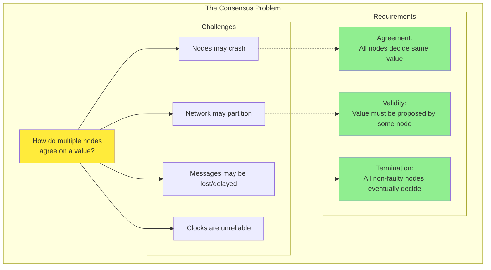
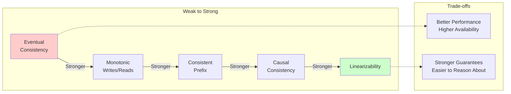
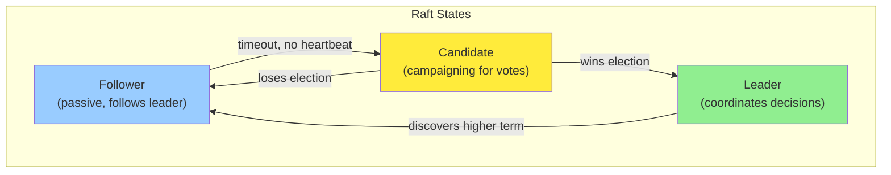
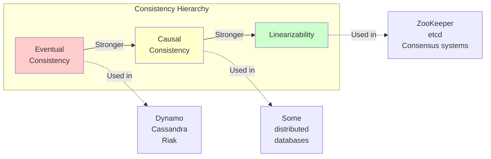

## Introduction

In Chapters 5-8, we've discussed replication, partitioning, transactions, and the problems of distributed systems. Now we'll explore one of the most important abstractions for building fault-tolerant distributed systems: **consensus**.

**Consensus** means getting several nodes to agree on something. This sounds simple, but is surprisingly difficult to solve in a distributed system where nodes and networks can fail.



Consensus is at the heart of many distributed systems problems:
- **Leader election**: Nodes must agree on which node is the leader
- **Atomic commit**: All nodes must agree to commit or abort a transaction
- **State machine replication**: All nodes must agree on the order of operations
- **Total order broadcast**: All nodes must deliver messages in the same order

This chapter explores consistency guarantees, ordering, and consensus algorithms that make distributed systems reliable.

## Consistency guarantees

When we replicate data, different replicas may process updates at different times. What guarantees can we provide about when updates become visible?

### The spectrum of consistency models



**Eventual Consistency** (weakest):
- If no new updates, all replicas eventually converge to same value
- No guarantee about when this happens
- Replicas may diverge in the meantime

**Linearizability** (strongest):
- System appears as if there's only one copy of the data
- All operations appear to happen atomically at a single point in time
- Once a read returns a value, all subsequent reads return that value or a newer one

## Linearizability

**Linearizability** (also called atomic consistency or strong consistency) is the strongest consistency guarantee. It makes a distributed system appear as if there's only a single copy of the data.

### What is linearizability?

**Key property**: Once a write completes, all subsequent reads (by any client) must return that value or a newer value. The system acts as if operations happen in a single, total order.

### Linearizability vs. serializability

These terms are often confused, but they're different:

| Aspect | Linearizability | Serializability |
|--------|----------------|------------------|
| What | Recency guarantee on reads/writes | Isolation guarantee for transactions |
| Scope | Single object (or register) | Multiple objects |
| Purpose | Make distributed system look like single copy | Prevent race conditions in transactions |
| When | Real-time ordering | Can reorder as long as result equivalent to serial execution |

<Info>
**Can have both**: **Strict serializability** = Serializability + Linearizability
</Info>

### Implementing linearizability

**Approaches**:

1. **Single-leader replication** (potentially linearizable)
   - Reads from leader or synchronously updated follower
   - Writes to leader

2. **Consensus algorithms** (linearizable)
   - Raft, Paxos, ZAB
   - Ensure all operations happen in agreed-upon order

3. **Multi-leader replication** (not linearizable)
   - Concurrent writes to different leaders
   - No total ordering

4. **Leaderless replication with quorums** (usually not linearizable)
   - Even with strict quorums (r + w > n), edge cases exist
   - Network delays can cause issues

### The cost of linearizability

Linearizability has performance costs:

<Warning>
**CAP theorem**: In the face of a network partition, you must choose between:
- **Consistency** (linearizability)
- **Availability**

Most systems choose availability (eventual consistency) over linearizability.
</Warning>

**When to use linearizability**:
- Leader election (must have one leader)
- Constraints and uniqueness (username, file locks)
- Cross-channel timing dependencies

**When not to use linearizability**:
- Most applications (eventual consistency is fine)
- Geo-distributed systems (too slow)
- High availability is critical

## Ordering guarantees

Many distributed systems problems boil down to **ordering**: making sure all nodes agree on the order in which things happened.

### Causality

**Causality** imposes an ordering on events: cause comes before effect.

**Causal consistency**: Operations that are causally related must be seen in the same order by all nodes. Concurrent operations can be seen in any order.

**Why causality matters**:
- Question comes before answer
- Row must be created before updated
- User must be registered before posting

### Happens-before relationship

Operation A **happens-before** operation B if:
1. A and B are in the same thread, and A comes before B
2. A is sending a message, B is receiving that message
3. Transitivity: If A happens-before C, and C happens-before B, then A happens-before B

**Concurrent operations**: If neither happens-before the other, they're concurrent.

### Capturing causality with version vectors

**Version vectors** track causality between operations:

```python
class VersionVector:
    def __init__(self, node_id):
        self.node_id = node_id
        self.vector = {}  # node_id -> counter

    def increment(self):
        """Increment this node's counter"""
        self.vector[self.node_id] = self.vector.get(self.node_id, 0) + 1

    def update(self, other_vector):
        """Merge another version vector"""
        for node_id, counter in other_vector.items():
            self.vector[node_id] = max(
                self.vector.get(node_id, 0),
                counter
            )

    def happens_before(self, other):
        """Check if this version happens before other"""
        all_less_or_equal = all(
            self.vector.get(node, 0) <= other.vector.get(node, 0)
            for node in set(self.vector.keys()) | set(other.vector.keys())
        )

        some_strictly_less = any(
            self.vector.get(node, 0) < other.vector.get(node, 0)
            for node in set(self.vector.keys()) | set(other.vector.keys())
        )

        return all_less_or_equal and some_strictly_less

    def concurrent(self, other):
        """Check if operations are concurrent"""
        return not self.happens_before(other) and not other.happens_before(self)
```

### Sequence numbers and total ordering

**Simpler than version vectors**: Assign incrementing sequence numbers to operations.

**Solution: Lamport timestamps** - Include node ID to break ties

```python
class LamportTimestamp:
    def __init__(self, node_id):
        self.counter = 0
        self.node_id = node_id

    def next(self):
        self.counter += 1
        return (self.counter, self.node_id)

    def update(self, other_timestamp):
        """Update counter based on received timestamp"""
        other_counter, other_node = other_timestamp
        self.counter = max(self.counter, other_counter)
```

**Lamport timestamps provide total ordering**, but they don't capture causality perfectly (can't tell if events are concurrent).

### Total order broadcast

**Total order broadcast** (also called atomic broadcast): Protocol for exchanging messages between nodes where all nodes deliver messages in the same order.

**Properties**:
1. **Reliable delivery**: If message delivered to one node, delivered to all
2. **Totally ordered delivery**: All nodes deliver messages in same order

**Uses**:
- **State machine replication**: All nodes process commands in same order
- **Database replication**: All replicas apply updates in same order
- **Serializable transactions**: Assign transaction IDs in total order

<Info>
**Total order broadcast ≈ Consensus**:
- Can implement consensus using total order broadcast
- Can implement total order broadcast using consensus
- They're equivalent problems!
</Info>

## Distributed transactions and consensus

Now we get to the core: **consensus algorithms** that allow nodes to agree on something despite failures.

### Two-phase commit (2PC)

We covered 2PC in Chapter 7, but let's revisit it as a consensus algorithm.

**Goal**: Get all nodes to agree to commit or abort a transaction

<Warning>
**Why 2PC is not true consensus**:
- Coordinator is a single point of failure
- If coordinator crashes after PREPARE, participants are blocked
- Cannot tolerate coordinator failure
</Warning>

### Consensus algorithms

True consensus algorithms can tolerate node failures without blocking:
- **Paxos** (1989): Theoretically proven, complex
- **Raft** (2013): Easier to understand, becoming popular
- **ZAB** (ZooKeeper Atomic Broadcast): Used by Apache ZooKeeper
- **Viewstamped Replication** (1988): Similar to Raft

**Properties they guarantee**:
- **Uniform agreement**: All nodes decide the same value
- **Integrity**: No node decides twice
- **Validity**: If node decides v, then v was proposed by some node
- **Termination**: Every non-faulty node eventually decides

### Raft consensus algorithm

Raft is easier to understand than Paxos. Let's explore how it works.

**Key idea**: Elect a leader, leader coordinates all decisions

#### Leader election



**Key points**:
- Each node votes for at most one candidate per term
- Candidate needs majority of votes to become leader
- Leader sends periodic heartbeats to maintain authority

#### Log replication

Once a leader is elected, it coordinates all client requests.

**Key properties**:
- If two logs contain entry with same index and term, they're identical up to that point
- If entry is committed, all future leaders will have that entry
- Committed entries are never lost

#### Handling failures

**Follower crash**: Leader keeps retrying AppendEntries until follower recovers

**Leader crash**: New leader elected, may need to repair logs

**Log matching principle**: New leader's log is the "truth" - overwrites conflicting entries on followers

### Consensus system invariants

Consensus algorithms maintain strong invariants:

<Accordion title="Raft Invariants">
**Election Safety**:
- At most one leader per term
- Only one candidate can get majority votes in a term

**Leader Append-Only**:
- Leader never overwrites or deletes entries
- Leader never overwrites its own log entries

**Log Matching**:
- If two logs have same entry at same index, all preceding entries are identical
- Log consistency across all nodes

**Leader Completeness**:
- If entry committed in term, it will be present in all future leaders
- Committed entries are never lost

**State Machine Safety**:
- If node applies log entry at index, no other node applies different entry at same index
- All nodes execute same commands in same order
</Accordion>

### Consensus performance limitations

Consensus isn't free - it has costs:

**Typical Numbers**:
- Commit latency: ~10-100ms
- Throughput: ~10k-100k ops/sec
- Fault tolerance: Can lose f nodes out of 2f+1

**When to use consensus**:
- Leader election
- Metadata storage (small amounts of critical data)
- Configuration management
- Lock services

**When NOT to use consensus**:
- High-throughput data storage (use replication instead)
- Geo-distributed systems (too slow)
- Anywhere eventual consistency is acceptable

## Membership and coordination services

In practice, most applications don't implement consensus algorithms directly. Instead, they use **coordination services** like ZooKeeper.

### Apache ZooKeeper

ZooKeeper is a distributed coordination service that implements consensus (ZAB algorithm, similar to Raft).

**What ZooKeeper provides**:
- Linearizable key-value store
- Watch notifications for changes
- Atomic operations (test-and-set)
- Ephemeral nodes (session-based)
- Sequential nodes (automatic numbering)

**Use Cases**:
- Leader Election
- Distributed Locks
- Configuration Management
- Service Discovery
- Coordination Primitives

#### Leader election with ZooKeeper

```python
class ZooKeeperLeaderElection:
    def __init__(self, zk_client, election_path):
        self.zk = zk_client
        self.election_path = election_path
        self.node_path = None

    def run_for_election(self, node_id):
        # Create ephemeral sequential node
        # e.g., /election/node-0000000001
        self.node_path = self.zk.create(
            f"{self.election_path}/node-",
            value=node_id,
            ephemeral=True,      # Deleted when session ends
            sequential=True       # Auto-numbered
        )

        # Check if we're the leader
        self.check_leader()

    def check_leader(self):
        # Get all candidates
        children = self.zk.get_children(self.election_path)
        children.sort()

        # Lowest sequence number is the leader
        if children[0] == self.node_path.split('/')[-1]:
            self.become_leader()
        else:
            # Watch the node before us
            predecessor = self.get_predecessor(children)
            self.zk.exists(
                f"{self.election_path}/{predecessor}",
                watch=self.check_leader  # Callback when it disappears
            )

    def become_leader(self):
        print(f"I am the leader! {self.node_path}")
        # Do leader stuff...
```

#### Distributed locks with ZooKeeper

```python
class ZooKeeperLock:
    def __init__(self, zk_client, lock_path):
        self.zk = zk_client
        self.lock_path = lock_path
        self.node_path = None

    def acquire(self):
        # Create ephemeral sequential node
        self.node_path = self.zk.create(
            f"{self.lock_path}/lock-",
            ephemeral=True,
            sequential=True
        )

        while True:
            children = self.zk.get_children(self.lock_path)
            children.sort()

            # If we're first, we have the lock
            if children[0] == self.node_path.split('/')[-1]:
                return True

            # Otherwise, wait for predecessor to disappear
            predecessor = self.get_predecessor(children)
            self.zk.exists(
                f"{self.lock_path}/{predecessor}",
                watch=lambda: None  # Wait for notification
            )
            # Block until watch fires
            time.sleep(0.1)

    def release(self):
        # Delete our node to release lock
        self.zk.delete(self.node_path)
```

### Alternatives to ZooKeeper

| Feature | ZooKeeper | etcd | Consul |
|---------|-----------|------|--------|
| Algorithm | ZAB (Paxos-like) | Raft | Raft |
| Language | Java | Go | Go |
| API | Custom | gRPC, HTTP | HTTP, DNS |
| Watch | Yes | Yes | Yes |
| Service Discovery | Manual | Via API | Built-in |
| Health Checks | No | Via API | Built-in |
| Used By | Hadoop, Kafka | Kubernetes | HashiCorp stack |

## Summary

This chapter covered the theory and practice of consistency and consensus in distributed systems.

### Key concepts

**Consistency Models**:



**Linearizability**:
- Strongest single-object consistency
- System behaves as if only one copy
- Expensive: limits performance and availability
- Use for: leader election, locks, critical metadata

**Ordering and Causality**:
- Many problems reduce to ordering
- Causality: natural partial order (A causes B)
- Total order: artificial total order (sequence numbers)
- **Lamport timestamps**: Total order that respects causality
- **Version vectors**: Detect concurrent operations

**Consensus Algorithms**:

| Property | 2PC | Paxos | Raft | ZAB |
|----------|-----|-------|------|-----|
| Fault Tolerance | ❌ Coordinator SPOF | ✓ | ✓ | ✓ |
| Blocking | ❌ Yes | ✓ No | ✓ No | ✓ No |
| Complexity | Simple | Very complex | Understandable | Medium |
| Used In | Databases | Rare (theory) | etcd, Consul | ZooKeeper |

**Consensus guarantees**:
- Agreement: All nodes decide same value
- Validity: Decided value was proposed
- Termination: All non-faulty nodes eventually decide
- Integrity: Nodes decide at most once

### Practical takeaways

<Accordion title="When to use what consistency model">
**Use Eventual Consistency when**:
- High availability is critical
- Geographic distribution required
- Application can tolerate temporary inconsistency
- E.g., social media feeds, shopping carts

**Use Causal Consistency when**:
- Need to preserve cause-effect relationships
- Some inconsistency acceptable
- Better performance than linearizability needed
- E.g., comment threads, collaborative editing

**Use Linearizability when**:
- Strong consistency absolutely required
- Leader election or distributed locks
- Unique constraints (usernames, IDs)
- Can accept performance cost
- E.g., bank account balance, inventory count
</Accordion>

<Accordion title="Anti-patterns to avoid">
**What NOT to do**:
- Don't use consensus for high-throughput data
- Don't use linearizable storage for everything
- Don't implement Paxos yourself (use library)
- Don't use ZooKeeper as a database
- Don't ignore network partitions in design
- Don't assume clocks are synchronized
</Accordion>

### The FLP impossibility result

**Fischer, Lynch, Paterson (1985)**: In an asynchronous system where even one process can crash, there's no deterministic algorithm that always reaches consensus.

**But we have consensus algorithms?** They work because:
- Real systems are not purely asynchronous (timeouts work *most* of the time)
- Algorithms use randomization (e.g., random election timeouts in Raft)
- Trade termination guarantee for liveness (may not terminate, but won't give wrong answer)

### Looking forward

Consensus is fundamental to distributed systems, but it's not the only way to build reliable systems. In real-world applications:

- **Most data doesn't need consensus**: Eventual consistency is fine
- **Consensus for coordination only**: Leader election, configuration
- **Avoid consensus when possible**: It's slow and complex
- **When you need it, use a library**: ZooKeeper, etcd, Consul

<Tip>
**Final thought**: Building distributed systems is hard. Understanding consistency, ordering, and consensus helps you make informed trade-offs between consistency, availability, and performance.
</Tip>
